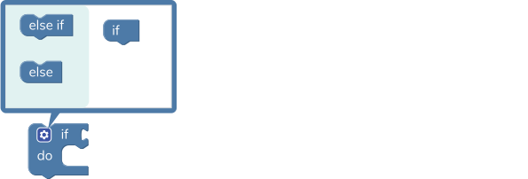
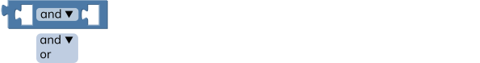
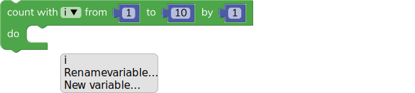

[//]: <> (Dictionary of blocks for watchX Blocks             )
[//]: <> (                                                   )
[//]: <> (by Enes CALDIR - argeX                             )
[//]: <> (16/09/2021                                         )
[//]: <> (                                                   )
[//]: <> (licensed under GNU V3.0                            )


<br/>

<br/>

This section is dedicated to the deciding blocks. These blocks are used for checking a condition and deciding what to do in that situation.

---

### **if**
<br/>

This block checks the condition of the block connected to the if side. If the connected block returns **true**, the block does the defined operation on the do side.

<br/>

You can expand this block and add more if states by clicking the options button. You can also add an else state to the end. This **else state** initiates if none of the **if states** doesn't work.

---

### **value check**
<br/>

This block checks the condition between two values. Returns true when the condition is correct.

```sh
= equal
≠ not equal
< less than
≤ less or equal than
> greater than
≥ greater or equal than
```

---

### **and & or**
<br/>

This block returns true when **both** or **one of** the conditions are true in the same block.

---

### **not**
<br/>

This block returns the **reverse** of true or false.

---

### **true & false**
<br/>

This block returns true or false.

---

### **null**
<br/>

This block returns null.

---

### **test**
<br/>

This block checks the condition of the test block. If the test returns true, returns the true block. If the test returns false, it will return the false block.

---

<br/>

This section is dedicated to the looping blocks. These blocks are used for repeating tasks multiple times.

---

### **repeat "X" times**
<br/>

This block repeats the do operation as given times.

---

### **repeat while & until**
<br/>

This block repeats the do operation **while** the repeat statement is true. Or **until** the repeat statement is true.

---

### **count from "X" to "Y"**
<br/>

This block counts from one value to another by given intervals. You can generate a new variable to count with this block. And it does the do operation while counting.

---

### **break & continue loop**
<br/>

This block breaks out of the current containing loop or skips the rest of the loop and continues with the next iteration.

---

<br/>

This section is dedicated to the math blocks. These blocks are used for basic or advanced mathematical operations.

---

### **number**
<br/>

This block returns the number. You can see this block being used in different blocks as well.

---

### **basic operations**
<br/>

This block does the basic math operations between two blocks.

```sh
+ plus
− minus
× multiplication
÷ division
^ power
```

---

### **advanced operations**
<br/>

This block does the advanced math operations between two blocks.

```sh
square-root square root
absolute absolute value
- multiplication with -1
ln natural logarithm
log10 base 10 logarithm
e^ power of e
10^ power of 10
```

---

### **trigonometric operations**
<br/>

This block does the trigonometric math operations between two blocks.

```sh
sin sinus
cos cosine
tan tangent
asin arc sinus (inverse sinus)
acos arc cosine (inverse cosine)
atan arc tangent (inverse tangent)
```

---

### **constants**
<br/>

This block returns the constant value selected.

```sh
π pi (3,141...)
e Euler number (2,718...)
φ golden ratio (1,618...)
sqrt(2) square root of 2 (1,414...)
sqrt(½) square root of ½ (0,707...)
∞ infinity
```

---

### **variable type check**
<br/>

This block checks the type of variable and returns true if the variable type is correct.

```sh
even a whole number that is dividable by 0 and 2 (0, 2, 4, 6, 8 ...)
odd a whole number that is not dividable by 2 (1, 3, 5, 7, 9 ...)
prime a whole number greater than 1 with only two divisible – themselves and 1
whole a number that include natural numbers and zero, not a fraction or decimal
positive a number that is greater than 0
negative a number that is less than 0
divisible-by a number that is divisible by another number
```

---

### **add to variable**
<br/>

This block changes the variable selected by the number of other value connected.

---

### **round**
<br/>

This block rounds the value. It can do regular round operations or round up and down.

*for example;*
> **round** 1.4 -> 1 or 6.5 ->7 or 3.8->4

> **round up** 1.4 -> 2 or 6.5 ->7 or 3.8->4

> **round down** 1.4 -> 1 or 6.5 ->6 or 3.8->3

---

### **remainder**
<br/>

This block returns the remainder from the division of the two blocks.

*for example;*
> remainder of 8÷3 is 2

> remainder of 94÷5 is 4

> remainder of 7÷7 is 0

---

### **constrain**
<br/>

This block constrains the value in between two numbers.

---

### **random integer**
<br/>

This block generates a random integer number in between two numbers.

---

### **random fraction**
<br/>

This block generates a random fraction.

---

### **re-map**
<br/>

This block remaps a value between 0 and a specified value.

---

<br/>

This section is dedicated to the writing blocks. These blocks are used for text operations. You can write a text, combine different text parts and do more...

---

### **string**
<br/>

This block returns the text written as a string. You can use this block to write text in your code. It can be a letter, a word or a sentence.

---

### **create text**
<br/>

This block creates text by combining different text parts together.

<br/>

You can expand this block and add more text by clicking the options button. This block is useful when combining different numbers and texts and aligning them on the display.

---

### **append text**
<br/>

This block appends a text to a variable.

---

### **lenght of text**
<br/>

This block calculates and returns the length of the text.

*for example;*
> lengh of "hello" is 5

---

### **empty text check**
<br/>

This block checks if the text is empty or not. Returns true when the text box is empty.

---

<br/>

This section is dedicated to the variable blocks. These blocks are used for defining new variables and setting new values to those variables.

---

### **variable**
<br/>

This block returns the value of the variable. You can create a new variable and rename it. New variables will appear on the **variable toolbox**.

---

### **set variable to**
<br/>

This block sets the value of the variable to the connected block.

---

### **set variable to**
<br/>

This block will set the value and type of the variable as selected.

```sh
character a single 16 bit unicode character
text a text that can consist of words or sentences
boolean a value that is either true(1) or false(0)
short-number value between -32.768 and 32.767 (inclusive)
number value between -2.147.483.648 and 2.147.483.647 (inclusive)
large-number value between -9.223.372.036.854.775.808 and 9.223.372.036.854.775.807 (inclusive)
decimal a double precision floating point number
```

Every variable that you create occupies a place in the memory. Each variable type requires different memory sizes.

| variable type | memory size |
| ------ | ------ |
| character | 1 byte |
| text | 1 byte × number of characters  |
| boolean | 1 bit |
| short-number | 1 byte |
| number | 2 bytes |
| large-number | 4 bytes |
| decimal | 4 bytes |

---

### **set variable as**
<br/>

This block sets a variable to the specific type.

---

<br/>

This section is dedicated to the function blocks. These blocks are used for defining new functions. You can define functions to use them in your tasks easily.

---

### **watchX run first & loop forever**
<br/>

This block is designed for watchX. Every code you make must be constructed under this block.

**watchX run first** section is dedicated to setting basic settings for your code. You can define variables and constants here to use them in your looping code. It only executes for once and continues with the loop forever.

**watchX loop forever** section is dedicated to your looping code. Since the code we constructed is running as firmware. It must be in a looping configuration.

---

### **new function**
<br/>

This block defines a new function. You can write a name for your function from the **do something** section. Functions are useful for doing complicated tasks in a simple fashion. Once you define a function, It will appear in the **functions toolbox**. Then you can call that function in different places of your code to run a specific task.

*You can check the "Watch Face" example from the "examples" section for sample use case.*

---

### **new function with return**
<br/>

This is the same block as the **new function**, but it returns a value or a specific block you connect to the return side at the end of it's cycle.

You can use the returned value that will appear in the **functions toolbox**.

---

### **if - return**
<br/>

This block returns the second value if the first value is true.

---

<br/>

This section is dedicated to the input/output blocks. These blocks are used for gathering and sending information from different buttons and pins.

#### **read button**
<br/>

This block reads the button press of the watchX and returns true if the button is pressed. If the button continues to be pressed, it will **continue** to return the true value.

<br/>

---

#### **read button once**
<br/>

This block reads the button press of the watchX and returns true if the button is pressed. But this block will return the true value for a **single instance** even if the button stays pressed.

<br/>

---

#### **read G-Pad button**
<br/>

This block reads the button press of the G-Pad and returns true if the button is pressed. If the button continues to be pressed, it will **continue** to return the true value.

<br/>

---

#### **read G-Pad button once**
<br/>

This block reads the button press of the G-Pad and returns true if the button is pressed. But this block will return the true value for a **single instance** even if the button stays pressed.

<br/>

---

#### **LED control**
<br/>

This block controls the LED's on the watchX. If you set an LED to HIGH it will turn on. If you set an LED to LOW it will turn off.

<br/>

---

#### **LED brightness level**
<br/>

This block controls the LED brightness levels.

<br/>

---

#### **LED brightness manual control**
<br/>

This block controls the LED brightness levels. You can enter a value between 0 and 255.

<br/>

---

#### **digital pin control**
<br/>

This block controls the digital pins. You can use this block with Arduino Adaptor and control other devices.

---

#### **digital pin read**
<br/>

This block reads the inputs from digital pins. You can use this block with Arduino Adaptor and receive information from other devices.

---

#### **analog pin control**
<br/>

This block controls the analog pins. You can use this block with Arduino Adaptor and control other devices. The connected value must be between 0 and 255.

---

#### **analog pin read**
<br/>

This block reads the inputs from analog pins. You can use this block with Arduino Adaptor and receive information from other devices.

---

#### **pin state**
<br/>

This block sets the pin state as HIGH or LOW.

---

#### **measure pin**
<br/>

This block measures the duration of a HIGH or LOW pulse on the selected pin.

---

#### **measure pin with timeout**
<br/>

This block measures the duration of a HIGH or LOW pulse on the selected pin if it's within the timeout limits.

---

<br/>

This section is dedicated to the time blocks. These blocks are used for setting - reading time and date values and pausing or ending your code.

### **get current time & date**
<br/>

This block gets the current time & date information from your computer and sets it to the internal clock of the watchX.

---

### **set time & date**
<br/>

This block sets the time & date information to the internal clock of the watchX as you set.

---

### **get manual time & date**
<br/>

This block reads the time & date information from the internal clock of the watchX.

---

### **display time in line**
<br/>

This block displays the time in the selected line.

<br/>

---

### **display time in coordinate**
<br/>

This block displays the selected time value in the specific coordinate.

<br/><br/>

<br/>

---

### **wait - milliseconds**
<br/>

This block waits for given milliseconds and continues to the operation.

*1000 milliseconds is equal to 1 second*

---

### **wait - microseconds**
<br/>

This block waits for given microseconds and continues to the operation.

*1.000.000 microseconds is equal to 1 second*

---

### **current elapsed time - milliseconds**
<br/>

This block returns the current elapsed time in milliseconds.

*1000 milliseconds is equal to 1 second*

---

### **current elapsed time - microseconds**
<br/>

This block returns the current elapsed time in microseconds.

*1.000.000 microseconds is equal to 1 second*

---

### **wait forever**
<br/>

This block waits forever. Therefore, it ends the operation.

---

<br/>

This section is dedicated to the audio blocks. These blocks are used for playing tones from the buzzer.

---

### **play note & beat**
<br/>

This block plays the selected note for a given beat time. watchX plays the notes at 60 beats per minute.

<br/>

<br/><br/>

| beat | time |
| ------ | ------ |
| zero | 0 milliseconds |
| eighth | 125 milliseconds |
| quarter | 250 milliseconds |
| half | 500 milliseconds |
| whole | 1000 milliseconds |
| double | 2000 milliseconds |

---

### **play frequency**
<br/>

This block plays a frequency in Hz. Lower numbers will sound like bass and higher numbers will sound like treble.

---

### **turn off the tone**
<br/>

This block stops the playing tone on the pin selected. (the pin for the buzzer of the watchX is 9)

---

<br/>

This section is dedicated to the motor control blocks. These blocks are used for servo or stepper motor control operations.

---

### **servo control**
<br/>

This block sets the servo motor connected on the selected pin to a specific angle.

<br/>

---

### **servo read**
<br/>

This block reads the servo position on the connected pin.

<br/>

---

### **stepper control**
<br/>

This block controls the stepper motor within the given parameters.

---

### **stepper move by steps**
<br/>

This block moves the stepper motor by given steps.

---

<br/>

This section is dedicated to the communication blocks. These blocks are used for serial communication operations.

---

### **serial comm. speed**
<br/>

This block sets the serial communication baud rate.

---

### **serial print**
<br/>

This block sends a message from serial port. If you select the "add new line" every message will appear in a new line.

---

### **prompt text**
<br/>

This block returns the text or number that users sends from the serial port to the watchX.

---

### **serial setup**
<br/>

This block sets the SPI serial communication settings.

---

### **send SPI message**
<br/>

This block sends SPI message to the selected pin.

---

### **send SPI message & receive back**
<br/>

This block sends SPI message to the selected pin and returns the received value.

---

<br/>

This section is dedicated to the display blocks. These blocks are used for displaying text or setting brightness of the display.

---

### **write on a line**
<br/>

This block writes the text with respect to the line and align option selected. You can also replace the text box with a number or other value to show them on the watchX Display.

<br/>

---

### **write on a coordinate**
<br/>

This block writes the text to the specific coordinate. You can also replace the text box with a number or other value to show them on the watchX Display.

<br/><br/>

<br/>

---

### **display brightness**
<br/>

This block changes the brightness of the watchX Display. You can use the LOW setting for better battery life or the HIGH setting for better daylight visibility.

---

### **display power**
<br/>

This block turns on or off the watchX Display. Set the power HIGH to turn on and LOW to turn off.

---

### **clear display**
<br/>

This block clears all of the drawn an written items from the watchX Display.

---

<br/>

This section is dedicated to the drawing blocks. These blocks are used for drawing lines, pixels (dots) or different icons on the display.

---

### **draw pixel**
<br/>

This block draws a single pixel (dot) at the specific coordinates on the watchX Display. A pixel is the smallest object you can draw on the display. You can make icons, characters and much more with this block.

<br/>

---

### **draw line**
<br/>

This block draws a line between two specific points on the watchX Display.

<br/>

<br/>

---

### **draw battery level**
<br/>

This block draws the **battery level icon** at the specific coordinates on the watchX Display. You can choose the percentage of the battery level that you want to show.

<br/><br/>

The **battery level** icon will appear like this;

<br/>

You can also use this block with **get battery level (%)** block to show the current charge level of your watchX.

*You can check the "Watch Face" example from the "examples" section for sample use case.*

---

### **draw USB icon**
<br/>

This block draws the **USB connected** icon at the specific coordinates on the watchX Display.

<br/><br/>

The **USB icon** icon will appear like this;

<br/>

You can also use this block with **check USB connection** block to show the USB connection status of your watchX.

*You can check the "Watch Face" example from the "examples" section for sample use case.*

---

### **draw charge icon**
<br/>

This block draws the **charging** icon at the specific coordinates on the watchX Display.

<br/><br/>

The **charge icon** icon will appear like this;

<br/>

You can also use this block with **detect charge complete** block to show the charging status of your watchX.

*You can check the "Watch Face" example from the "examples" section for sample use case.*

---

<br/>

This section is dedicated to the sensor blocks. These blocks are used for getting information from the sensors.

---

#### **get IMU angle**
<br/>

This block returns the **angular position** data of the selected axis. IMU sensor (inertial measurement unit) consists of an accelerometer and a gyroscope. It can sense angular displacement and acceleration in 3 axes. Therefore, it can measure motion in 6 axes.

**The angle data is measured in ° (degrees).**

You can check the IMU axis with respect to the watchX below.

<br/>


---

#### **get IMU acceleration**
<br/>

This block returns the **acceleration** data of the selected axis. IMU sensor (inertial measurement unit) consists of an accelerometer and a gyroscope. It can sense angular displacement and acceleration in 3 axes. Therefore, it can measure motion in 6 axes.

**The acceleration data is measured in m/s² (peter per second square).**

You can check the IMU axis with respect to the watchX below.

<br/>

---

#### **detect free fall**
<br/>

This block returns true if the watchX is free falling. You can adjust the free fall threshold and duration. This block can be used for counting steps or jumps and more...

---

#### **detect motion**
<br/>

This block returns true if any motion is detected. You can adjust the motion detection threshold and duration. This block can be used for motion alarms and more...

---

#### **get temperature & pressure**
<br/>

This block returns the sensor value selected. The BMP280 sensor can measure temperature and pressure at the same time. Therefore it can calculate estimated barometric altitude as well.

**The altitude data is measured in m (meters).**

**The pressure data is measured in P (Pascal).**

**The temperature data is measured in °C (Celcius).**

---

#### **get magnetometer**
<br/>

This block returns the magnetic field data from the MLX90393 sensor. You can select the magnetic field measurement axis and filter it for ease of use.

**The magnetic field data is measured in µT (microtesla).**

You can check the magnetometer axis with respect to the watchX below.

<br/>

---

#### **get MAG3110**
<br/>

This block returns the magnetic field data from the MAG3110 sensor. This sensor has been replaced with the MLX90393 for the watchX V1.3 and later.

**The magnetic field data is measured in µT (microtesla).**

---

<br/>

This section is dedicated to the battery blocks. These blocks are used for getting information from the battery.

### **get battery level (V)**
<br/>

This block returns the battery level value in Volts. The usable voltage range for a standard LiPo battery cell is **3.2v to 4.2v**.

watchX automatically begins to charge it's battery when connected to a power source via the **provided USB cable**. The charging operation is carried out by an internal charging controller. You can not change or modify the charging procedure with coding.

---

### **get battery level (%)**
<br/>

This block returns the battery level value in as % (percantage) in between 0 - 100.

The usable voltage range for a standard LiPo battery cell is **3.2v to 4.2v**. The battery voltage and charge percentage is not in a linear relation.

You can check the graph below to see the relation between the battery voltage and charge percantage.

<br/>

watchX automatically begins to charge it's battery when connected to a power source via the **provided USB cable**. The charging operation is carried out by an internal charging controller. You can not change or modify the charging procedure with coding.

---

### **detect gharge complete**
<br/>

This block returns true when the charging is complete.

watchX automatically begins to charge it's battery when connected to a power source via the **provided USB cable**. The charging operation is carried out by an internal charging controller. You can not change or modify the charging procedure with coding.

---

<br/>

This section is dedicated to the USB blocks. These blocks are used for checking USB connection.

---

### **check USB connection**
<br/>

This block returns true when a USB connection is made.

---

<br/>

This section is dedicated to the sleep blocks. These blocks are used for sleeping functionality. You can use sleep for better battery life.

---

#### **sleep & wake on button press**
<br/>

This block sleeps the control unit of the watchX. When the selected button is pressed, it will wake the control unit up again. Sleep function is useful for saving the battery.

<br/>

---

#### **sleep & wake on time**
<br/>

This block sleeps and wakes up the control unit of the watchX by the selected intervals. Sleep function is useful for saving the battery.

---

<br/>

This section is dedicated to the Bluetooth blocks. These blocks are used for Bluetooth communication.

---

### **Bluetooth transceiver id**
<br/>

This block sets the Bluetooth module to different modes. ID is a unique number that sets the Bluetooth devices apart from the other ones.

```sh
transceiver data send and receive mode
BT_keyboard Bluetooth keyboard mode
HID_control Human Interface Device mode
```

---

### **Bluetooth send**
<br/>

This block sends a text or a numeric value to the connected Bluetooth device.

---

### **Bluetooth receive text**
<br/>

This block receives a text or a numeric value from the connected Bluetooth device.

---

### **Bluetooth key press**
<br/>

This block sends a key press value to the connected Bluetooth device.

---

### **Bluetooth media control**
<br/>

This block controls multimedia aspects of the connected Bluetooth device.

---

### **Bluetooth mouse control**
<br/>

This block controls the mouse inputs of the connected device.

---

(C)2021 argeX Inc. All Rights Reserved
